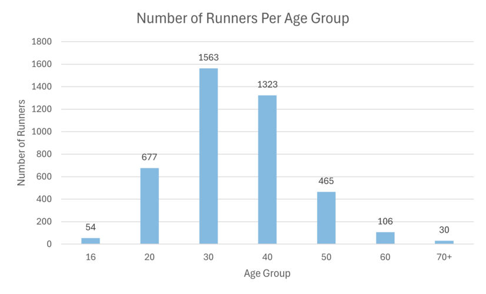
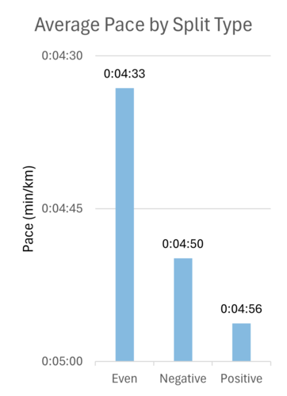
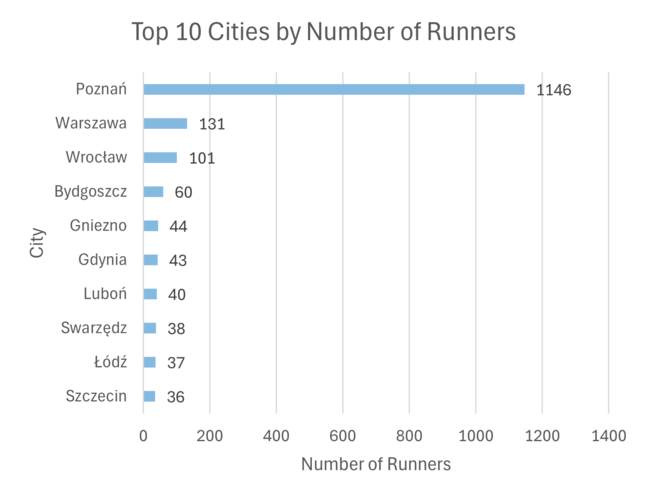
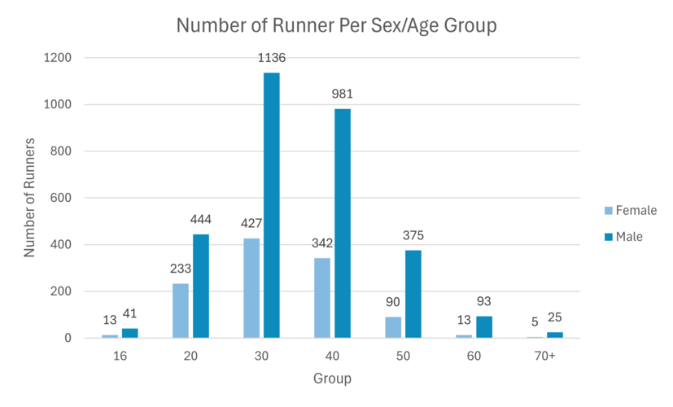
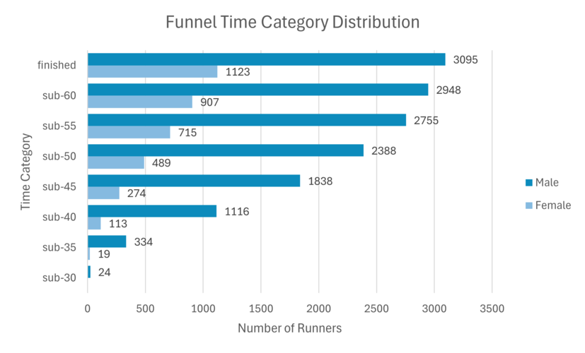
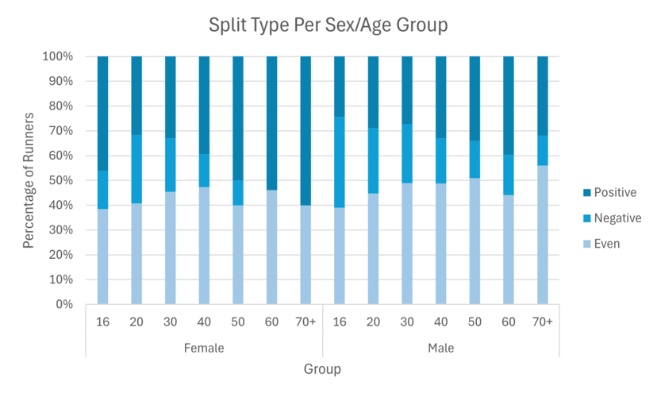

# 🟩 Excel Data Analysis Project – 10km Race Results

## 📚 Table of Contents

- [🚀 Summary](#-summary)
- [📝 Project Description](#-project-description)
- [📁 Dataset](#-dataset)
- [🛠️ Data Preparation](#-data-preparation)
- [📊 Tools Used](#-tools-used)
- [🧮 Formulas & Calculations](#-formulas--calculations)
- [📊 Dashboard Visuals Overview](#-dashboard-visuals-overview)
- [📊 Filtered Race Stats – Dashboard Visuals](#-filtered-race-stats--dashboard-visuals)
- [🧠 General Insights from Race & Filtered Dashboards](#-general-insights-from-race--filtered-dashboards)
- [📊 Runner's Stats – Dashboard Visuals](#-runners-stats--dashboard-visuals)
- [💡 What I Learned](#-what-i-learned)

## 🚀 Summary

This data analytics portfolio project showcases the use of Microsoft Excel to extract, transform, and analyze detailed race data from the 2025 **Recordowa Dziesiątka** 10 km race. The goal was to create a fully interactive Excel dashboard that explores pacing strategies, demographic breakdowns, and performance metrics across 4,218 participants. Key Excel tools such as Power Query, Power Pivot, DAX measures, Pivot Charts, and advanced formulas were used to uncover actionable insights and tell a compelling data story.

## 📝 Project Description

This project analyzes results from the **Recordowa Dziesiątka** – one of the most popular 10 km road races in Poland, held annually in Poznań. The race is known for its flat, fast course and attracts thousands of runners, including elite athletes and amateurs.

The goal of this project is to explore participant data to uncover trends related to age, gender, performance, and pacing. The final result includes an interactive Excel dashboard that presents key insights and comparisons between different runner groups.

## 📁 Dataset

- **Source:** [Plus Timing – Recordowa Dziesiątka 2025](https://wyniki.plus-timing.pl/w/recordowa10-2025)
- **Original Format:** PDF (official race results)
- **Processed Format:** Converted to Excel (.xlsx) for analysis
- **Content Overview:**\
  The dataset contains detailed information for each race participant, including:
  - Overall position
  - Bib number
  - First and last name
  - Country
  - Running club or team
  - City
  - Age category
  - Position within age category
  - Gender position (men/women)
  - 5 km split time
  - Net finish time
  - Gun (official) finish time
  - Net time gap (to leader)
  - Gun time gap (to leader)
  - Average pace (min/km)

## 🛠️ Data Preparation

The dataset was extracted and transformed using **Power Query** and a modular M script structured into clearly labeled sections (e.g., `Load & Prepare Raw Data`, `Clean Table Layout`, etc.). A custom function `transform_data` was used to process each of the 211 pages of the race PDF individually, allowing for consistent parsing, extraction of embedded 5K times, and normalization of layout inconsistencies.

The process included removing headers/footers, promoting headers, handling split times embedded in names or adjacent rows, and consolidating cleaned tables into one unified dataset. Additional transformation steps followed to enrich and categorize the data before final analysis.

### 📥 PDF Import

- The original data came from a 212-page race result PDF.
- The default `Table001` loaded by Power Query was incomplete, so each page (`Page001`–`Page211`) was processed individually.

### 🧩 Custom Function: `transform_data`

A reusable **custom function** was applied to each page to:

- Remove header/footer rows
- Promote headers
- Split embedded 5K split times from runner names
- Extract missing 5K splits from adjacent rows
- Keep only valid result rows
- Unify final columns and clean up helper columns

### 🧼 Main Query: `recordowa_dziesiatka_results`

The function output was consolidated into a single table with additional transformations:

- **Renamed columns** to English
- **Standardized missing data**, fixed formatting for pace/time
- **Converted times** into proper duration types
- **Calculated**:
  - 5–10K split
  - Time differences
  - Percentage change
  - Split classification (`Positive`, `Even`, `Negative`) using a parameter `split_threshold_percentage = 0.02`

### ➕ Data Enrichment

- Extracted **Sex** from age category
- Flagged **club members**
- Normalized **city names** (e.g. various spellings of "Poznań", "Wrocław", etc.)
- Extracted **age** and created custom **milestone bins** (sub-30, sub-35, ..., sub-60)
- Assigned runners to **time categories**

### 🧮 Supporting Table: `recordowa_dziesiatka_results_categories`

- Extracted Bib numbers and **expanded time category lists** into rows for easier filtering/analysis.

## 📊 Tools Used

This project was built entirely in **Microsoft Excel** using the following tools and features:

- **Power Query** – for importing, cleaning and transforming raw PDF data
- **Excel Tables & Data Model** – structured tables and relationships managed via **Power Pivot**
- **Power Pivot Measures** – custom DAX measures:
  - `avg_10k_chip_time` → `AVERAGE([10K Chip Time])`
  - `avg_pace` → `AVERAGE([Pace])`
- **Pivot Tables, Pivot Charts & Slicers** – dynamic data summaries and filters
- **Charts & Visualizations** – including clustered column, stacked column, funnel-style bar charts, and XY scatter plots
- **Dashboards**:
  - **Race Stats** – overall metrics and visualizations
  - **Filtered Race Stats** – filtered by gender and age group
  - **Runner's Stats** – detailed view by bib number

## 🧮 Formulas & Calculations

Key Excel functions used in the project:

- `IF` – conditional logic
- `COUNTIF` – count with condition
- `INDEX` – return value by position
- `VLOOKUP` – lookup by bib number
- `TEXTBEFORE` – extract text before delimiter
- `SORT` – sort array or range
- `UNIQUE` – get distinct values
- `MAKEARRAY` – create custom arrays
- `LAMBDA` – inline custom logic

## 📊 General Race Statistics Dashboard

This dashboard provides detailed statistics for the race event, including overall race data, participant demographics, and various performance metrics. The visualizations help to analyze the distribution of runners, chip times, pace, and other relevant statistics across different categories.

---
### 🔹 Top Section – **General Overview**
This section contains three KPIs displayed in rectangular boxes:
- **Number of Runners** – total number of race participants: **4218**
- **Avg Chip Time** – average net time: **0:47:20**
- **Avg Pace (min/km)** – average pace: **0:04:44**

---

### 🔹 Middle Section – **Charts**
This section contains nine charts:

1. **Number of Runners Per Age Group**  
2. **Average Chip Time Per Age Group**  
3. **Funnel Time Category Distribution**  
4. **Split Type Distribution**  
5. **Average Pace by Split Type**  
6. **Time Distribution with Popular Milestones Highlighted**  
7. **Top 10 Clubs by Number of Runners**  
8. **Average Pace by Club Members**  
9. **Top 10 Cities by Number of Runners**

---

### 🔹 Left Section – **Navigation (Sidebar Menu)**
Includes three options for switching between dashboard views:
- **Race Stats** (current view)
- **Filtered Race Stats**
- **Runner’s Stats**

---

*Overview of General Race Statistics Dashboard*

Descriptions of the main charts used in the **General Race Statistics** dashboard:

### 1. Number of Runners Per Age Group

🛠️ **Excel Features:** Clustered column chart with data labels\
🎨 **Design Choice:** Vertical bars sorted by age for intuitive comparison\
📉 **Data Organization:** Participants grouped by age category\
💡 **Insights Gained:** The 30s (1,563 runners) and 40s (1,323 runners) account for **over 68% of all participants (2,886 out of 4,218)**, clearly dominating the race demographics.

### 2. Average Chip Time Per Age Group

🛠️ **Excel Features:** Clustered column chart with time-formatted axis\
🎨 **Design Choice:** Clear visual representation of average race time by age\
📉 **Data Organization:** Bars sorted by age group\
💡 **Insights Gained:** The average finish time **does not follow a linear trend** — it improves from ages 16 to 30 (30s are the fastest), then worsens steadily from age 40 onward. This reflects both peak athletic performance and natural age-related decline.

### 3. Funnel Time Category Distribution

🛠️ **Excel Features:** Horizontal bar chart designed to mimic funnel shape\
🎨 **Design Choice:** Ordered by performance tiers, from most to least inclusive\
📉 **Data Organization:** Time categories like sub-30, sub-35, ..., finished\
💡 **Insights Gained:** **1,229 runners** finished under 40 minutes — that's **almost 30% of all participants**, highlighting both the **fast course** and the **high athletic standard** of the race.

### 4. Split Type Distribution

🛠️ **Excel Features:** Clustered column chart with percentages formatted on the Y-axis\
🎨 **Design Choice:** Vertical bar chart comparing pacing strategy proportions\
📉 **Data Organization:** Single-category comparison across three pacing types: Even, Positive, and Negative\
💡 **Insights Gained:** Even splits were most common (approx. 47%), followed by positive (33%) and negative splits (20%). This shows that a large proportion of runners paced themselves evenly, and relatively few managed to run a negative split (faster second half).

### 5. Average Pace by Split Type

🛠️ **Excel Features:** Clustered column chart with pace-formatted labels\
🎨 **Design Choice:** Side-by-side comparison of pacing strategies\
📉 **Data Organization:** Average pace per split type\
💡 **Insights Gained:** Runners with even splits had the fastest average pace, followed by negative splits. Positive splits resulted in the slowest paces, confirming the efficiency of steady pacing.

### 6. Time Distribution with Milestones

🛠️ **Excel Features:** Clustered column chart acting as a histogram\
🎨 **Design Choice:** 1-minute bins help identify pacing density\
📉 **Data Organization:** Distribution of chip finish times\
💡 **Insights Gained:** More runners finished **just before milestone minutes** (e.g., 39, 44, 49, 54, 59) than at the milestone itself (40, 45, etc.), indicating that **many runners actively pushed to break symbolic time barriers** — and succeeded.

### 7. Top 10 Clubs by Number of Runners

🛠️ **Excel Features:** Horizontal bar chart\
🎨 **Design Choice:** Better visibility of club names\
📉 **Data Organization:** Clubs sorted by number of participants\
💡 **Insights Gained:** Poznań-based clubs dominated the top 10, with “adidas Runners Poznań” and “Mistrzowski Trening” leading the pack.

### 8. Average Pace by Club Members

🛠️ **Excel Features:** Clustered column chart with boolean comparison\
🎨 **Design Choice:** Simple true/false grouping for clear contrast\
📉 **Data Organization:** Club members vs non-members\
💡 **Insights Gained:** Club members ran significantly faster on average. This suggests that **joining a club tends to happen later in a runner’s journey**, often among those who are already experienced and looking to improve further.

### 9. Top 10 Cities by Number of Runners

🛠️ **Excel Features:** Horizontal bar chart\
🎨 **Design Choice:** Sorted to highlight city-level participation\
📉 **Data Organization:** Cities ranked by runner count\
💡 **Insights Gained:** Poznań led by a wide margin as the host city, while major Polish cities like Warsaw and Wrocław also had strong representation.

## 📊 Filtered Race Stats – Dashboard Visuals
This dashboard presents race statistics segmented by gender and age group, with interactive filters at the top of the view. All KPIs and charts dynamically respond to the selected filter values.

---

### 🔹 Top Section – **Filters and Summary KPIs**
The dashboard includes two interactive filters:
- **Sex**: Female, Male  
- **Age Group**: 16, 20, 30, 40, 50, 60, 70+

Below the filters are three KPI indicators:
- **Number of Runners** – total number of race participants: **4218**
- **Avg Chip Time** – average net time: **0:47:20**
- **Avg Pace (min/km)** – average pace: **0:04:44**

**All three KPIs are integrated with the filters and update dynamically based on the selected gender and age group.**

---

### 🔹 Middle Section – **Charts**
This section contains nine charts:

1. **Number of Runner Per Sex/Age Group**  
2. **Average Chip Time Per Sex/Age Group**  
3. **Funnel Time Category Distribution**  
4. **Split Type Per Sex/Age Group**  
5. **Time Distribution**  
6. **Percentage of Club Members by Age**  
7. **Percentage of Club Members by Sex**  
8. **Number of Runners by Club Members**

**All charts are connected to the filters and automatically adjust to reflect the selected data scope.**

---

### 🔹 Left Section – **Navigation (Sidebar Menu)**
Contains three options to switch between dashboard views:
- **Race Stats**
- **Filtered Race Stats** (current view)
- **Runner’s Stats**
---

*Overview of Filtered Race Statistics Dashboard*

The following visualizations come from the dashboard: ***Filtered Race Stats***

### 1. Number of Runners Per Sex/Age Group

🛠️ **Excel Features:** Clustered column chart with side-by-side bars\
🎨 **Design Choice:** Male/Female comparison within each age group\
📉 **Data Organization:** Participants grouped by both sex and age\
💡 **Insights Gained:** Males dominated participation in all age groups, especially in their 30s and 40s. Female participation peaked in the 30s and declined with age. The overall age distribution is similar for both men and women.Males dominated participation in all age groups, especially in their 30s and 40s. Female participation peaked in the 30s and declined with age.

### 2. Average Chip Time Per Age Group (by Sex)

🛠️ **Excel Features:** Clustered column chart with dual series (male vs female)\
🎨 **Design Choice:** Compare pacing trends between sexes within age groups\
📉 **Data Organization:** Average chip time by sex and age group\
💡 **Insights Gained:** Men consistently achieved faster chip times than women across all age brackets. The fastest average times were recorded by men in their 30s. Time distribution patterns are similar across both sexes.Men consistently achieved faster chip times than women across all age brackets. The fastest average times were recorded by men in their 30s.

### 3. Funnel Time Category Distribution (by Sex)

🛠️ **Excel Features:** Horizontal stacked bar chart\
🎨 **Design Choice:** Cumulative view with gender split\
📉 **Data Organization:** Time categories by sex\
💡 **Insights Gained:** A significant portion of males achieved sub-50 and sub-45 times, while female runners were more concentrated in the sub-55 and sub-60 categories.

### 4. Split Type by Age Group (Stacked %)

🛠️ **Excel Features:** 100% stacked column chart\
🎨 **Design Choice:** Show pacing strategy distribution by age and gender\
📉 **Data Organization:** Split types (Even, Positive, Negative) grouped by both sex and age\
💡 **Insights Gained:** Even splits dominate all age groups. Positive splits increase slightly with age, suggesting a decline in endurance pacing among older runners.

### 5. Time Distribution (by Sex)

🛠️ **Excel Features:** Clustered column chart with dual series\
🎨 **Design Choice:** Histogram distribution by chip time with gender overlay\
📉 **Data Organization:** 1-minute finish time bins by gender\
💡 **Insights Gained:** Both men and women peak around 43–45 minutes, but male performance is more concentrated in faster bins.

### 6. Percentage of Club Members by Age Group

🛠️ **Excel Features:** 100% stacked column chart\
🎨 **Design Choice:** Membership rate by age\
📉 **Data Organization:** TRUE/FALSE club affiliation\
💡 **Insights Gained:** Club membership increases with age, with over 60% of runners aged 40+ being affiliated with a club.

### 7. Percentage of Club Members by Sex

🛠️ **Excel Features:** 100% stacked column chart\
🎨 **Design Choice:** Simple binary comparison\
📉 **Data Organization:** Club membership by sex\
💡 **Insights Gained:** Club affiliation is slightly more common among males, suggesting higher club engagement. Men tend to be more driven by competition and structure, which could explain their greater tendency to join running clubs.Club affiliation is slightly more common among males, suggesting higher club engagement.

### 8. Number of Runners by Club Members

🛠️ **Excel Features:** Clustered column chart\
🎨 **Design Choice:** Compare absolute numbers\
📉 **Data Organization:** Count of members vs non-members\
💡 **Insights Gained:** Club runners outnumber non-members, which reinforces the importance of community in amateur running.

## 🧠 General Insights from Race & Filtered Dashboards

### 🎯 Demographics & Participation

- The most represented age groups were 30s and 40s, accounting for over 68% of all participants.
- Men outnumbered women in every age group, while female participation was more evenly distributed across ages 20–40.
- Poznań dominated the city rankings, followed by Warsaw and Wrocław, reflecting strong local and national interest.

### ⏱️ Performance & Pacing

- The average chip time was **47:20**, and average pace was **4:44 min/km**, indicating a fast, competitive race.
- Men consistently ran faster than women in every age category, with peak performance in the 30–39 age group.
- Even pacing (even splits) was the most common strategy and also associated with the fastest finishing times.
- Positive splits increased with age, especially among women, reflecting pacing difficulties in the second half.

### 📉 Time Distribution & Milestone Barriers

- Many runners finished just before popular milestone times (39:59, 44:59, etc.), suggesting a psychological push to break those barriers.
- Men were overrepresented in the fastest time bins (30–45 minutes), while women were more evenly spread between 40 and 60 minutes.

### 🏃‍♂️ Club Membership & Impact

- Club membership increased with age — over 60% of runners aged 40+ were club-affiliated.
- Men were slightly more likely to join clubs, possibly due to greater interest in structured competition.
- Club runners performed better on average, highlighting the benefits of guided training and running communities.

## 📊 Runner's Stats – Dashboard Visuals

This dashboard provides detailed individual statistics for a selected runner based on their bib number. It allows performance comparison against all race participants.

---

### 🔹 Top Section – **Runner Selection and Individual Details**

- On the left, there is a panel with the **Select Bib Number** input and a **Select** button.
- After selecting a runner, detailed individual metrics are displayed in the central area.

#### **Displayed Runner Information**:
- **Runner’s Name, Bib, Time, Avg Pace, Age Category** – core identification and performance data.
- **General Place & Age Category Place** – overall and age group ranking.
- **Split Info:** 5K and 5–10K times, pacing type, and a natural language split description.
- All values dynamically update based on the selected bib number using the Slicer.

---

### 🔹 Bottom Section – **Visualizations**

Two charts allow the selected runner's performance to be compared against the entire field:

1. **Pace by Place with Highlighted Runner’s Pace**  
   – Line chart showing pace (min/km) across placements, with the selected runner highlighted.

2. **Time Distribution with Highlighted Runner’s Time**  
   – Histogram showing the overall distribution of finish times, highlighting the selected runner's result.

---

### 🔹 Left Section – **Navigation and Runner Selection**

The sidebar provides navigation and runner selection:
- **Race Stats**
- **Filtered Race Stats**
- **Runner’s Stats** (active view)
- **Select Bib Number** – input field for choosing a specific runner to display

---

*Overview of Runners Statistics Dashboard*

### 1. Pace by Place with Highlighted Runner's Pace

🛠️ **Excel Features:** XY scatter chart with annotation for selected runner\
🎨 **Design Choice:** Position-vs-pace curve with custom marker\
📉 **Data Organization:** Each point represents a runner’s placement and pace\
💡 **Insights Gained:** This chart allows users to quickly assess how the selected runner compares to others in the race. It visually shows how competitive their pace is in relation to the full field. The chart also reveals that the **leading runners are significantly faster** than those behind them, creating a steep initial curve. Toward the end of the race (places 4000–4500), the curve flattens out, indicating a dense cluster of slower runners with relatively small variations in pace.

### 2. Time Distribution with Highlighted Runner’s Time

🛠️ **Excel Features:** Clustered histogram with personalized data overlay\
🎨 **Design Choice:** Highlight runner's finish time within the full time distribution\
📉 **Data Organization:** All runners binned by chip time, with the selected runner visually marked\
💡 **Insights Gained:** This view helps users understand how the selected runner performed relative to others. It gives context to their result (e.g., faster than X% of all runners), showing how fast was selected runner.

## 💡 What I Learned

Working on this project helped me gain deep hands-on experience with Excel as a powerful end-to-end analytics platform. Key takeaways include:

- How to handle complex PDF imports using **Power Query**, especially by building modular M code and reusable custom functions.
- Structuring large-scale transformations by breaking down logic into clear stages (cleaning, enrichment, categorization).
- Building and managing a **Data Model** with **Power Pivot** and writing custom **DAX measures** for performance KPIs.
- Creating fully interactive dashboards using **Pivot Tables, Slicers, and Charts** for dynamic exploration.
- Designing visualizations that not only present data but tell a compelling story — including pacing strategies, demographic trends, and performance comparisons.
- Applying advanced Excel formulas (`MAKEARRAY`, `LAMBDA`, `VLOOKUP`, `TEXTBEFORE`, etc.) to build dynamic, user-driven components.

This project strengthened my technical skills and reinforced best practices in organizing and communicating insights in a professional analytics context.

